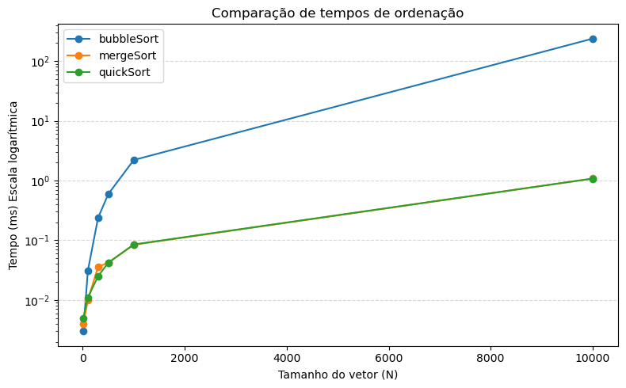

# Relatório de Algoritmos de Ordenação

## 1. Introdução
Este relatório apresenta o desempenho de três algoritmos de ordenação clássicos
(bubbleSort, mergeSort e quickSort) para diferentes tamanhos de vetor.

## 2. Metodologia

- **Medição de tempo:** Milissegundos.  
- **Vetores testados:**  
  - **Inicial**: N=10, vetor fixo `{1,3,2,8,3,4,6,5,9,10}`.  
  - **Randômicos**: N = 100, 300, 500, 1000, 10000 (valores aleatórios).  
- Cada algoritmo ordena uma cópia independente do vetor original.

## 3. Resultados

| Algoritmo   |  N    | Tempo (ms) |
|-------------|-------|------------|
| bubbleSort  | 10    | 0.003 ms   |
| mergeSort   | 10    | 0.004 ms   |
| quickSort   | 10    | 0.005 ms   |
| bubbleSort  | 100   | 0.031 ms   |
| mergeSort   | 100   | 0.010 ms   |
| quickSort   | 100   | 0.011 ms   |
| bubbleSort  | 300   | 0.237 ms   |
| mergeSort   | 300   | 0.036 ms   |
| quickSort   | 300   | 0.025 ms   |
| bubbleSort  | 500   | 0.593 ms   |
| mergeSort   | 500   | 0.042 ms   |
| quickSort   | 500   | 0.042 ms   |
| bubbleSort  | 1000  | 2.205 ms   |
| mergeSort   | 1000  | 0.084 ms   |
| quickSort   | 1000  | 0.085 ms   |
| bubbleSort  | 10000 | 237.271 ms |
| mergeSort   | 10000 | 1.078 ms   |
| quickSort   | 10000 | 1.077 ms   |

## 4. Gráfico de Desempenho

## 5. Discussão
- **bubbleSort** cresce de forma quadrática e fica proibitivo para N grandes.  
- **mergeSort** e **quickSort** mostram crescimento quase linear.  
- Entre eles, o `quickSort` foi um pouco mais rápido nesse ambiente.

## 6. Conclusão
Conclui-se que, para vetores pequenos (N≤100), a diferença é irrlevante; a partir de N=1000,
algoritmos de complexidade superior a O(n²) tornam-se menos performáticos. `QuickSort` ou
`MergeSort` são melhores para grandes volumes de dados.

